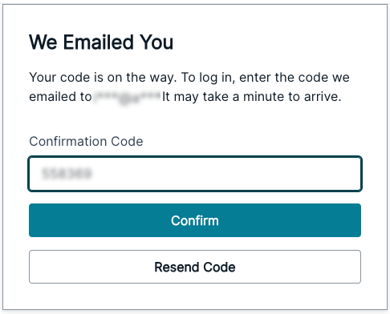

# AI Learning Assistant

## Introduction

This project provides a web-based application that allows users to upload media files (audio recordings or videos) and generate accurate **transcriptions** for easier content review. In addition to transcriptions, users can select a foundation model to obtain further insights and features such as:
- **Summaries:** Get concise overviews of the transcribed content.
- **Flashcards:** Automatically generated study aids based on the content, perfect for reinforcing key information.
- **Personalized Chat Assistant:** An AI-powered assistant that answers questions about the uploaded media.

For enhanced **accessibility**, the app supports multiple languages, allowing you to visualize the page in your **preferred language**, translate the content, and even hear it in the desired language. This makes it an inclusive tool for users from various linguistic backgrounds.

> [!NOTE]
> This implementation is designed for processing small videos only, using synchronous polling for transcription results. 
>
> Please use this code only as a reference implementation to build your own production solution.


## Architecture Diagram

The architecture that is deployed with this sample is the following: 


## Repository structure

```
├── backend              --> Contains CDK code for hosting the backend resources (e.g. S3 buckets, Lambda functions, etc)
├── frontend             --> Contains frontend code for navigating the application 
├── images               --> Contains the architecture and screenshots of the application
├── README.md

```

## Prerequisites for deployment
* [AWS Account](https://repost.aws/knowledge-center/create-and-activate-aws-account): You will need an AWS account to deploy the project.
* [Node and NPM](https://docs.npmjs.com/downloading-and-installing-node-js-and-npm) JavaScript runtime for running build and deployment scripts and a package manager for Node.js.
* [AWS Cloud Development Kit (AWS CDK)](https://docs.aws.amazon.com/cdk/v2/guide/home.html) Software development framework for defining and provisioning cloud infrastructure resources. This project uses the CDK in **TypeScript**.
* [AWS CLI:](https://docs.aws.amazon.com/cli/latest/userguide/install-cliv2.html) Command-line tool for interacting with AWS services.
* [IAM User Setup (If Using Access Keys):](https://docs.aws.amazon.com/cli/latest/userguide/install-cliv2.html) 
Ensure you have an IAM user with permissions to push to the frontEndS3Bucket deployed with cdk (e.g., s3:PutObject). Create the user in IAM, configure the AWS CLI with `aws configure`, and activate the profile.
* [AWS IAM Identity Center Setup (If Using AWS SSO):](https://docs.aws.amazon.com/cli/latest/userguide/install-cliv2.html) Ensure your AWS IAM Identity Center role has permissions to push to the frontEndS3Bucket deployed with cdk (e.g., s3:PutObject). Authenticate via AWS SSO using `aws configure sso` and activate the role.
* [VS Code](https://code.visualstudio.com/download): Install Visual Studio Code or your preferred IDE for TypeScript development and deployment of the stack.
* [Python 3](https://www.python.org/): The core language used for backend development.
* [Pip 3](https://pip.pypa.io/en/stable/): Python's package installer. It is usually installed alongside Python 3. 
* [Pipenv](https://pipenv.pypa.io/en/latest/): A tool that aims to bring the best of all packaging worlds (bundled dependencies, virtual environments, and lockfiles) to the Python world. 
* [Docker Desktop](https://docs.docker.com/desktop/) Application that lets you build, share, and run containerized applications and microservices. Ensure Docker Desktop app is open, running and added to your system's PATH to enable packaging of Lambda functions.

### Enabling Amazon Bedrock model access

> [!IMPORTANT]
> By default this stack deploys the resources in `us-west-2` (except for [AWS WAF](https://aws.amazon.com/waf/) which is deployed in `us-east-1`). To change the main deployment region go to `backend/bin/constants.ts` and change the value for `MAIN_STACK_REGION`.  

Before you can use a foundation model in [Amazon Bedrock](https://docs.aws.amazon.com/bedrock/latest/userguide/what-is-bedrock.html), you must request access to it. This sample uses Amazon Bedrock by sending prompts using foundation models to generate responses. You must activate the models you want to use in the region of the main stack deployment. You can follow this [guide](https://docs.aws.amazon.com/bedrock/latest/userguide/model-access-modify.html) to activate the models.

## Deploying the backend

> [!IMPORTANT]
> Before deploying your resources, please ensure you are using the intended AWS account. You can verify this using the following command:
> ```bash
> aws sts get-caller-identity
> ```

You will first start by deploying the backend cdk stacks. To get a list of all the AWS resources deployed with this stack check the resources section below.

Navigate to the backend directory:
```
cd backend
```

Install the node modules:
```
npm install
```

If this is your first time using the CDK for an account, you might need to bootstrap the environment:
```
cdk bootstrap
```

Deploy the CDK stacks:
```
cdk deploy --all
```

After a few minutes, the stacks should be deployed, lookout for the CDK Output variables in your terminal and find the `frontEndS3BucketName` and the `cloudfrontDomainUrl`. 

## Deploying the frontend 

> [!NOTE]
> Before deploying the frontend you need to have deployed the backend 

This section walk you through deploying the frontend code so you can access it in the domain given by the CDK Output `cloudfrontDomainUrl`. 

Navigate to the frontend directory:
```
cd ../frontend
```

Install the node modules:
```
npm install
```

Prepare the deployment:
```
npm run build
```

Zip the front end source code using the `zip-frontend.js` script:
```
node zip-frontend.js      
```

This will create a file in the parent directory named `frontend.zip`. Now, we only need to upload that file to the S3 bucket given by `frontEndS3BucketName` to trigger the pipeline that builds and deploys our front end code. Replace `frontEndS3BucketName` with the value given in the output and run the command
```
aws s3 cp ../frontend.zip s3://<frontEndS3BucketName>/frontend.zip
```

Once this process is done, you can check the pipeline running in the [AWS Management Console](https://console.aws.amazon.com/codepipeline/home).

> [!NOTE]
> You may notice that the first Pipeline execution `Failed` because when we deployed the backend, it triggered the pipeline run but there was no zip to build the static files

> [!SUCCESS]
> Once it is finished you can navigate to the url given by `cloudfrontDomainUrl` and you will be able to start using your application!

## Getting Started with the Application

### 1. Access the Application
   
Navigate to the URL of the application given by `cloudfrontDomainUrl` using your web browser. You will be presented with the authentication screen.


### 2. Create an Account
If this is your first time accessing the application:

- Click the **Create Account** button.
  


- Enter your **Username**, **Email**, and **Password**.
- You will receive a confirmation code in your email. Enter the code in the designated field to verify your account.
  


- After completing this step, you will be automatically logged in.

If you already have an account simply login into the application:


### 3. Navigating the Interface
Once logged in, you will notice the **top bar on the right**. Here you can:
- Select the language you wish to view the page in.
  


- Locate the **Sign out** button.

In the center of the page, you will see a **Get Started** button. 


Clicking this button will take you to the **upload screen**, where you can upload your audio or video file.

### 4. Preparing Your AWS Environment
Ensure that you have followed the steps in [Enabling Amazon Bedrock Model Access](###Enabling-Amazon-Bedrock-Model-Access) and activated the models you intend to use in the application. If these steps are not completed, the Lambda functions responsible for handling the foundational models will fail.

### 5. Uploading Media

On this page, you can upload your media file. Look for the `Browse Files` button on the page.
Click the button and select the file you want to upload from your device.


Your video media file will begin uploading to the media s3 bucket.


After uploading your media file, you will see a success message. 


> [!NOTE]
> The uploaded media **must contain audio** for the transcription job to succeed. If there is no audio, the job will fail.

### 6. Starting Transcription

After the media is successfully uploaded you will be able to start the transcription job.


Click on the **Get Transcript** button. This will trigger the transcription job and the button will change to a loading state. 

Notice the **Try another file** button. This button takes you back to the [Uploading Media](###5.Uploading-Media) step and you can restart using a different file.

> [!WARNING]
> Clicking **Try another file** discards the current uploaded media and all content associated.

Once completed, the transcription will be displayed on the page.


> [!NOTE]
> If the transcription job **takes longer than 10 minutes**, the application will stop polling for results. You will need to retry by clicking the Transcription button again or by using a shorter video.
>
> To modify the polling wait time and number of retries, refer to [Modifying the Frontend](#Modifying-the-frontend).

### 7. Browsing Features 

After the transcription job is finished you will see a `Buttons Grid` with all the features available for you to interact with your media.


Some features require loading before they are available for use. Each feature has a dedicated button, and once you click on the button, the loading process will begin. 


The button will enter a loading state, indicated by a loading animation, and once the feature has finished loading, a check mark will appear in the button to indicate it's ready to use.


Below you will be guided on how to interact with each feature.

### 8. Model Selection 

In the `Buttons Grid`, you will see a drop down with the label `Model`. Click on the dropdown and you will see a list of available text models powered by AWS Bedrock. Browse through the list and select the model that best fits your needs by clicking on it.


Once you’ve chosen a model, you can proceed to using the generative AI features.

> [!WARNING]
> When you modify the model all the content generated using the previous model will be cleared and you will have to load the features again.

### 9. Using Generative AI and accessibility features
Once the transcription is completed, you can perform additional actions:
- **Visualize your media** directly on the browser.
  


- **Request a Summary** of the transcription.
  


- **Generate Flashcards** based on the content.
  


- **Chat with your Personalized Assistant** to engage with the content further.
    


You will notice that for every feature an audio is also generated along with the content.

You can also select the preferred language for viewing and listening to content using the **language selector**, which will trigger the translation and synthesize of the content of every feature for you. 


If you now press one of the features for example, `Summary`, the content will be translated to your selected language in the form of text and audio.


This will also affect the language in which the assistant responds to you.


> [!NOTE]
> To modify the number of flashcards generated, refer to [(Optional) Modifying the Backend](#(Optional)-Modifying-the-Backend).

### 10. You're All Set!
With these steps completed, you're ready to start using the application. Enjoy the features, interact with the assistant, and explore your media content!

> [!NOTE] 
> Since we are working with generative AI, it’s important to remember that model responses are not guaranteed to be consistent or definitive. The output may vary, so this should be kept in mind when using the application. For details on how to adjust the model’s behavior, refer to [(Optional) Modifying the Backend](#(Optional)-Modifying-the-Backend), where you can learn how to modify parameters like temperature, maxTokenCount, etc for the selected model.
>
> Additionally, models may perform differently depending on the task. For example, one model might provide better summaries, while another may excel in chatbot interactions. It’s recommended to experiment with various models to find the one that best suits your needs.
>
> Keep in mind that Amazon Bedrock frequently adds new models and updates existing ones, as both Amazon and third-party providers continuously work to improve performance. Regularly check the available model list to see if newer, more effective models have been introduced. Before using a new model in the application, ensure that it has been activated by following the steps in the Activate Bedrock Models section.
 
## (Optional) Modifying the Frontend 

### 1. Navigate to the frontend directory
To begin modifying the frontend, navigate to the frontend directory from the root folder by running:
```
cd frontend
```

### 2. Install the Dependencies
Once inside the frontend directory, you’ll need to install the necessary libraries by running:

```
npm install
```

### 3. Configure Backend Resources
In order to build and run the frontend locally, you’ll need to configure the backend resources. These resources are not available in the local React environment because they were not run with the same build spec used in the Code Build Action. To link the frontend with the backend:

1. **Check the CDK Output Variables:**
After running  `cdk deploy `, the terminal will display output variables. These can also be viewed in the AWS Console by navigating to **CloudFormation**, selecting your stack, and viewing the output variables.

2. **Match and Replace Variables:**
Most of the output variables correspond to variables that need to be filled in the `aws-exports.ts` file located inside  `frontend/src `.

3. **Update `aws-exports.ts`:**
Replace the placeholder values in the `aws-exports.ts` file with the corresponding values from the CDK output. For example, replace `USER_POOL_ID`, `CLOUDFRONT_DOMAIN_NAME`, etc.

4. **Running the Frontend Locally**
Once the backend variables have been configured, you can run the application locally by executing:
```
npm run dev
```

This will launch the frontend on `localhost:5173`, and you’ll be able to interact with the application just as you would on the S3-hosted site. The application will use the same AWS resources you deployed with CDK.

5. **Modifying Frontend Components**
All the frontend logic and visualization are defined in TypeScript components located in the `frontend/src/components` directory. 

6. **Deploying Changes to S3**
Once you've tested your modifications locally and are satisfied with the results, build your app to be production-ready:
```
npm run build
```

Finally, you'll need to deploy the updated frontend to the frontend s3 bucket.

To do so, follow the steps outlined in the section `### Deploying the Frontend`. This will ensure your changes are reflected on the s3-hosted website. 

7. **Creating a CloudFront Invalidation**
If you wish to see your changes immediately reflected on the frontend website, you may need to create an invalidation (since CloudFront caches the s3 files):

1. Access the [**AWS Management Console**](console.aws.amazon.com/cloudfront/v4/home), in the **CloudFront** service page and find your distribution.
2. Navigate to the **Invalidations** tab, click on **Create Invalidation** and enter `/*` as the Object Path to invalidate all cached objects.
3. Click **Create Invalidation** to trigger the invalidation process.

This will clear the cached files and ensure that the latest version of your frontend code is served.

If your changes didn’t go as planned or you simply want to revert to a previous version of your application, versioning is enabled for the frontend S3 bucket. This means you can easily restore a previous version of the zip file you uploaded. To do so, check the [AWS documentation on restoring previous object versions](https://docs.aws.amazon.com/AmazonS3/latest/userguide/RestoringPreviousVersions.html) for step-by-step instructions.


### (Optional) Example 1: Extend Language Support

You might want to extend the application by adding support for additional languages, whether for viewing the UI in a different language or translating content into a new one. Here's how you can achieve this:

#### Change the Default Language
If you'd like the application to load in a specific language by default:

- Go to `frontend/src/locales/config.ts`.
- Modify the `lng` value to the language code of the desired default language (you can find the available language codes in the `supportedLngs` map).
  
#### Modify Text for a Specific Language
To change a specific value in an existing language:

- Go to `frontend/src/locales/config.ts`.
- In the `resources` JSON, find the entry for the language code you want to modify (you can find the available language codes in the `supportedLngs` map).
- Modify the key values to change the text values for buttons, titles, or other UI elements as needed.

#### Add a new language for visualizing the page
If you'd like to add a new language to visualize the page in, follow these steps:

1. **Add the Language to Supported Languages:**

- Go to `frontend/src/locales/config.ts`.
- In the `supportedLngs` map, add the language name and code for your new language. You can use any valid language code, but for ease, it's recommended to use [codes](https://docs.aws.amazon.com/polly/latest/dg/supported-languages.html) from [Amazon Polly](https://aws.amazon.com/polly/).
  
2. **Add Translations for the Language:**

- Go to `frontend/src/locales/config.ts`.
- In the `resources` JSON, create an entry for your new language using its language code (e.g., `fr` for French).
- Translate each of the keys to the desired language. Check one of the already existent language code entry for the keys that you need to set. This will define what the buttons, titles, etc in the app say in your new language.
- 
3. **Make the Language Selectable:**

- Go to `frontend/src/components/LanguageSelector.tsx`.
- In the `getOptions` method, add an option for your new language code. This will allow users to select your newly added language from the language selector dropdown.

You can now visualize the page in the new language.

#### Right-to-Left Language Support
If the language you've added is written from right to left (like Arabic or Hebrew):
- Go to `frontend/src/utils/languageUtils.ts`.
- Find the `ALIGN_TO_RIGHT_LANGUAGES` constant and add your language code there. This ensures the text will be displayed from right to left when the language is selected.

#### Add a New Language for Translating Content
To allow content translation into a new language, follow these steps:
- Go to `frontend/src/utils/languageUtils.ts`.
- Add the language name to the `AVAILABLE_LANGUAGES` array.
- Check if the language is available in the [list of supported languages](https://docs.aws.amazon.com/polly/latest/dg/supported-languages.html) from [Amazon Polly](https://aws.amazon.com/polly/) or if is is not, check if it is available in the [list of supported languages](https://docs.aws.amazon.com/polly/latest/dg/supported-languages.html) from [Amazon Translate](https://aws.amazon.com/translate/).
- If the language is available, add the respective language code to the `LANGUAGE_CODE_MAP`. 
- If the language is supported by [Amazon Polly](https://aws.amazon.com/polly/), you’ll get both translation and text-to-speech (TTS) support. If it's only available in [Amazon Translate](https://aws.amazon.com/translate/), the language will be supported for translation, but not TTS.
  
You can now translate content into the newly added language.

### Example 2: (Optional) Modify the Maximum File Size of Uploaded Audios and Videos to S3 Bucket

The maximum file size for uploads is set to 500 MB by default. To adjust the maximum file size for audios and videos uploaded to your S3 bucket, consider the following:

#### **Impact of Changing File Size**:
- **Storage Costs**: Larger files will increase your S3 bucket size, leading to higher storage costs.
- **User Experience**: Longer audio files take more time to process and can result in poor user experience.
- **Amazon Transcribe Limits**: The maximum file size for uploads via Amazon Transcribe is **2GB**, with a maximum audio length of **4 hours**.  
  - Refer to [Amazon Transcribe Documentation](https://docs.aws.amazon.com/general/latest/gr/transcribe.html) for updated limits.

#### **Steps to Modify Maximum File Size**:

1. **Locate MediaUploader Component**:
   - Navigate to `frontend/components` and open **MediaUploader**.

2. **Update `maxFileSize` Constant**:
   - Find the `maxFileSize` constant and set it to your desired limit (e.g., `maxFileSize = 100;` for 100MB).
  
3. **Adjusting Transcription Wait Time and Retries**:
   - To modify the wait time and number of retries for transcription jobs to handle longer processing efficiently, navigate to: `/frontend/src/components/Controller.tsx`. 
   - In this file, locate the `getTranscription` method and modify the `callApi` parameters to adjust the number of retries and the timeout between them.

4. **Rebuild Frontend Application**:
   - Save changes and rebuild your frontend by following the steps in  `## (Optional) Modifying the Frontend`.

## (Optional) Modifying the Backend
By following these steps, you can extend or modify the backend of the application, from adding new functionality to fine-tuning the AI models and user permissions.
The backend is written in TypeScript and is structured as a CDK (Cloud Development Kit) stack. The lambda functions are written in Python.

### Constants and Stack Configuration
In `bin/constants.ts`, you’ll find a list of constants used throughout the stack. You can modify some of these values, such as the names of the resources deployed.

> [!WARNING]
> If you change the value of resources like the `MAIN_STACK_REGION` or `STATIC_CONTENT_S3_BUCKET_SUFFIX` after deploying the stack, you will encounter errors, as CDK will no longer track the original resources. Be sure to check the [Deleting Resources](##Deleting-resources) for instructions on destroying the stack before changing variables and redeploying.

The `bin/backend.ts` declares the two CDK stacks:

- **WAF Stack**: Defines the Web Application Firewall (WAF) configuration.
- **Main Stack**: Contains the initialization of the primary stack that manages the application’s backend resources.
  
### Modifying Backend Resources
The backend resources are defined in `lib/main-stack.ts`. Here, besides you can modify the resources deployed (check ##Resources section for a list of the resources deployed by the stack). Here are some examples of how you can modify the backend resources:

1. **Change permissions for the authenticated users** 

You can change the permissions given to authenticated users in the app, who are assigned roles via Amazon Cognito.

By default, authenticated users only have read/write permissions to their own folder in the S3 bucket, ensuring that media, transcripts, summaries, and other data remain private to each user. If you wish to add more permissions to these users, find the `cognitoAuthRole` and update the policies by adding new AWS actions and resources.

2. **Configuring the Deployment Pipeline**
If you fork this repository and want to integrate it with your own CI/CD pipeline for easier deployment, you can configure the pipeline to trigger on changes to your GitHub repository:

- In the CDK stack, replace the [S3SourceAction](https://docs.aws.amazon.com/cdk/api/v2/docs/aws-cdk-lib.aws_codepipeline_actions.S3SourceAction.html) with a [GitHubSourceAction](https://docs.aws.amazon.com/cdk/api/v2/docs/aws-cdk-lib.aws_codepipeline_actions.GitHubSourceAction.html). This will enable automated deployments when you push changes to GitHub, eliminating the need to manually zip and upload the frontend files to S3.

This setup enables version control and easier management of the frontend updates, allowing you to track changes and roll back to previous versions of the backend and frontend if needed.

### Modifying Lambda Functions
To change the behavior of backend Lambda functions, navigate to `lib/lambda_functions/`. Each function has its own folder, and here are some examples of how you can modify functions:

1. **Modify the summary prompt when calling the foundation model:** Go to `get_summary/lambda-handler.py` and find the `get_summary` method, where you can adjust the system prompt sent to the Bedrock model for summarization.
2. **Modify the Lambda Layer:** The backend functions share common code through a Lambda layer located in `lib/layer/`. This layer helps simplify code reuse across different Lambdas. If you want to update common functionality, this is the place to modify it.

3. **Adapting to New Amazon Bedrock Models:**
Amazon Bedrock frequently adds new models and model families, each with its own configuration for requests and responses. To support these new models:

- Check `layer/python/bedrock_utils/`, where methods for generating model requests and processing responses are defined.
If new model versions or providers are introduced, you may need to update these methods to accommodate the new configuration.
- You can also modify the [inference configuration](https://docs.aws.amazon.com/bedrock/latest/userguide/model-parameters.html) to adjust the behavior of different models by modifying parameters such as the `temperature` to modify the likelihood of the model selecting higher-probability options while generating a response.

## Resources

Here is a consolidated list of the AWS resources deployed by the backend cdk stacks:

1. **S3 Buckets:**

- staticContentS3Bucket: An S3 bucket to serve static content (frontend).
- mediaS3Bucket: An S3 bucket to store videos, audios, transcriptions, etc.
- frontEndS3Bucket: An S3 bucket to upload the frontend code (serves as repository).
- logsBucketS3Bucket: An S3 bucket for storing logs such as s3 server access logging from the other buckets.
  
2. **CloudFront Distribution:**

- cloudfrontDistribution: A CloudFront distribution to serve the static content from the staticContentS3Bucket.
  
3. **Cognito:**

- userPool: A Cognito user pool.
- userPoolDomain: A custom domain name for the Cognito user pool.
- userPoolClient: A Cognito user pool client.
- identityPool: A Cognito identity pool.
  
4. **API Gateway:**

- api: A REST API.
- apiAuthorizer: A Cognito user pool authorizer for the API.
  
5. **Lambda Functions:**

- startTranscription: A Lambda function to start a transcription job.
- checkTranscription: A Lambda function to check the status of a transcription job.
- getSummary: A Lambda function to get a summary of a transcription.
- getFlashcards: A Lambda function to get flashcards generated from a transcription.
- askAssistant: A Lambda function to ask an AI assistant queries on the content of a transcription.
- getTranslation: A Lambda function to get a translation of the transcription and summary.
- checkAudio: A Lambda function to check the status of a speech synthesis task used for long texts.
- getModels: A Lambda function to get the list of Amazon Bedrock models.
  
6. **Lambda Layer:**

- utilsLayer: A Lambda layer containing common methods for the Lambda functions.

7. **CodePipeline:**

- pipeline: A CodePipeline pipeline to build and deploy the frontend.
  
8. **CodeBuild:**

- buildProject: A CodeBuild project to build the frontend.

9. **KMS:**

- buildKey: Encryption key for CodeBuild.

10.  **CloudTrail:**

- frontEndTrail: A CloudTrail trail to track changes to the frontend S3 bucket so we can trigger the pipeline on changes to the zip deployment.

11. **IAM:**

- cognitoAuthRole: A Cognito-authenticated IAM role to give permissions to authorized users to access the mediaS3Bucket.
- Roles and policies are also deployed for the other resources in the stack.

12. **WAF**:

- cloudfrontWebACL: Web ACL for CloudFront.
- apiGatewayWebACL: Web ACL for API Gateway.
  
13. **Bedrock**:
- bedrock_guardrail: Content safety controls for AI responses.

14. **CloudWatch**:
- Log groups for WAF, API Gateway, and Lambda functions.
- Alarms for WAF blocks and S3 storage usage.

## Deleting resources

This project deploys AWS resources, hence they can start incurring costs if left idle. To remove the resources created when deploying the stacks, follow the following instructions.

Navigate to the backend directory:
```
cd backend
```

> [!WARNING]
> By performing this step you will be deleting all the resource associated with the stacks and the files inside the deployed S3 buckets. This includes the media files uploaded when using the application and all content generated (e.g. transcriptions, audios, etc).

Remove all resources:
```
cdk destroy --all
```

## Security

See [CONTRIBUTING](CONTRIBUTING.md#security-issue-notifications) for more information.

### Definitions
- "Deploying Customer": The AWS account owner who deploys this solution from the AWS Samples GitHub repository
- "End User": Any individual who uses the deployed application/website

### Security Best Practice: Enable Multi-Factor Authentication (MFA) in Amazon Cognito

**IMPORTANT:** Deploying customers are responsible for implementing and enabling MFA in their Amazon Cognito configuration. While our app currently uses Amazon Cognito for authentication, **Multi-Factor Authentication (MFA) is not enabled by default**. We strongly recommend that you enable MFA for your Cognito user pool to significantly enhance security.

#### Why enable MFA?
- Adds an extra layer of protection beyond just a password
- Helps prevent unauthorized access even if your password is compromised
- Reduces the risk of identity theft and account takeovers

#### How to enable MFA in Cognito:
1. Sign in to the AWS Management Console and open the Amazon Cognito console
2. Choose the **user pool** you want to modify
3. Go to the **Advanced security** tab
4. Under **Features summary**, choose **Add MFA option**
5. Choose **Require MFA** 
6. Select the **MFA methods** you want to allow (e.g. SMS, Email and Authenticator Apps)
7. Click on **Save changes**

Once enabled, users will be prompted to set up MFA when they next sign in or during the sign-up process.

*By enabling MFA in Cognito, you're taking an important step to secure your users' accounts and protect their data. For more information on adding MFA to your Amazon Cognito user pool, visit: https://docs.aws.amazon.com/cognito/latest/developerguide/user-pool-settings-mfa.html*

### Security Best Practice: Server Access Logging for Amazon S3 Buckets

We have implemented server access logging as a security best practice for our Amazon S3 buckets. This feature is currently enabled and configured as follows:

- A dedicated `logsbucket` has been created to store logs.
- The other three buckets in our infrastructure are configured to send their server access logs to this `logsbucket`.

#### Benefits of Server Access Logging

Server access logging provides detailed records of requests made to a bucket. This practice:

- Assists in security and access audits
- Provides information on object requests, including:
  - Requester's IP address
  - Object requested
  - S3 response (including access denials)
  - IAM user or role involved and its account number

Keeping logging enabled helps in incident response and investigations, especially in cases where an attacker might gain access to bucket contents.

#### Disabling Server Access Logging (Optional)

While we strongly recommend keeping server access logging enabled, you may choose to disable it. Here are the steps to do so:

1. **Remove logging configuration from source buckets:**
   For each of the three source buckets:
   a. Open the S3 console and select the bucket
   b. Go to the **Properties** tab
   c. Scroll to the **Server access logging** section
   d. Click **Edit**
   e. Uncheck **Enable server access logging**
   f. Save changes

2. **Delete the `logsbucket`:**
   a. Ensure all logs have been backed up if needed
   b. Open the S3 console and select the `logsbucket`
   c. Click **Empty** to remove all contents
   d. Once empty, click **Delete** to remove the bucket

**Warning**: Disabling server access logging will result in:
- Loss of detailed access records for your buckets
- Reduced ability to perform security audits
- Limitations in incident response capabilities

*We strongly advise maintaining server access logging for enhanced security and compliance. If you choose to disable it, please ensure you have alternative logging or monitoring solutions in place.*

### Security Best Practice: Input Validation

While the application implements basic input validation, deploying customers may want to consider additional validation layers for enhanced security. Here's an overview of current controls and recommended improvements:

#### Current Server-Side Validation
1. **AWS WAF Rules**
   - Uses AWS Managed Rules Common Rule Set
   - Protects against common web exploits
   - Blocks malicious requests before they reach the application

2. **Lambda Runtime Validation**
   - Events are deconstructed to check for required fields
   - Throws errors for missing or invalid fields

#### Client-Side Validation
While client-side validation improves user experience, it should not be relied upon for security. Our application implements:
- File type checks for uploads
- File size validation
- Input sanitization for user queries
- Required field validation

#### Recommended Additional Controls
1. **API Gateway Request Validation**
   - Consider implementing request validators and models in API Gateway
   - Define JSON Schema models for request validation
   - Enable request validation on API methods
   
*For implementing API Gateway request validation, refer to: https://docs.aws.amazon.com/apigateway/latest/developerguide/api-gateway-method-request-validation.html*


### Security Best Practice: Regular Security Reviews and Testing

#### Current Implementation
This sample provides basic security controls through AWS services. However, as a sample application, it does not include automated security testing or regular configuration review processes.

#### Recommended Security Practices for Production Deployments

1. **Regular Security Configuration Reviews**
- Audit IAM roles and permissions
- Review API Gateway configurations
- Check S3 bucket policies and access settings
- Validate CloudFront security settings
- Assess WAF rules and effectiveness

2. **Security Testing Automation**
Consider implementing:
- Automated vulnerability scanning
- Infrastructure security compliance checks
- API security testing
- Regular penetration testing
- Automated configuration drift detection

For guidance on implementing these practices, refer to:
- AWS Security Hub: https://aws.amazon.com/security-hub/
- AWS Config: https://aws.amazon.com/config/
- AWS CloudWatch: https://aws.amazon.com/cloudwatch/
- AWS CloudTrail: https://aws.amazon.com/cloudtrail/
- AWS Inspector: https://aws.amazon.com/inspector/
- AWS GuardDuty: https://aws.amazon.com/guardduty/

### Security Best Practice: Resource Usage Limits

While this sample implements basic rate limiting through AWS WAF (2000 requests per 5 minutes per IP) and API Gateway throttling (500 rate limit, 1000 burst limit), deploying customers may want to implement additional per-user resource limits for production environments. Additionally, a CloudWatch alarm has been configured to monitor the media S3 bucket storage, triggering notifications when the total bucket size exceeds 50 GB to help prevent unexpected storage costs and maintain system performance.

#### Recommended Additional Controls

1. **API Gateway Usage Plans**
- Create usage plans to control access to your APIs
- Associate plans with specific API stages and users
  
*For detailed implementation guidance on API usage plans, visit: https://docs.aws.amazon.com/apigateway/latest/developerguide/api-gateway-api-usage-plans.html*

2. **Lambda Authorizer with Rate Limiting**
- Implement custom authorization logic to track and limit requests per user
- Store usage metrics in [Amazon DynamoDB](https://aws.amazon.com/dynamodb/) or other persistent storage

*For information on implementing access control in APIS with AWS Lambda authorizers, visit: https://docs.aws.amazon.com/apigateway/latest/developerguide/apigateway-use-lambda-authorizer.html*

3. **Cost Control Mechanisms**
- Set up AWS Budgets alerts
- Use AWS Cost Explorer to monitor service usage

*For information on implementing cost control mechanisms, visit: https://docs.aws.amazon.com/cost-management/latest/userguide/budgets-managing-costs.html and https://docs.aws.amazon.com/cost-management/latest/userguide/ce-what-is.html*

### Security Best Practice: Cost Allocation and Tagging

This application does not currently implement any cost allocation or tagging mechanisms. However, for production deployments, we recommend enabling the following:

1. **AWS Billing Consolidation**
   - Consolidate billing and payment across all AWS accounts in your organization
   - Allows for centralized cost tracking and optimization

*For detailed steps on enabling consolidated billing, visit: https://docs.aws.amazon.com/awsaccountbilling/latest/aboutv2/consolidated-billing.html*

2. **Cost Allocation Tags**
   - Create and apply resource tags to track costs by project, environment, team, etc.
   - Helps attribute costs to specific workloads or owners

*For information on cost allocation tags, visit: https://docs.aws.amazon.com/awsaccountbilling/latest/aboutv2/cost-alloc-tags.html*

3. **IAM Permissions for Tag Management**
   - Grant appropriate IAM permissions for creating, modifying, and enforcing tags
   - Ensure proper access controls for tag administration

*For guidance on managing access to billing and cost management, visit: https://docs.aws.amazon.com/awsaccountbilling/latest/aboutv2/control-access-billing.html*

Implementing these practices will enable better cost visibility, accountability, and chargeback capabilities for your AWS resources.

### Security Best Practice: Managing Bedrock Model Usage

This application leverages Amazon Bedrock for various AI capabilities, including content summarization, flashcard generation, and the personalized chat assistant. It's important to note that Bedrock models have rate limits and may occasionally be unavailable due to high demand or other factors.

#### Potential Risks

1. **Quota Exhaustion**: Excessive AI requests from users can consume available model quotas, leading to service unavailability for other users.
2. **Prompt Manipulation**: Malicious users may attempt to craft specialized prompts to manipulate AI model outputs, potentially generating unauthorized or harmful content.
3. **Abnormal Responses**: While rare, AI models can sometimes produce unexpected or abnormal responses, which could impact the reliability and safety of the application.

#### Existing Mitigations

1. **Strict Prompt Templates**
   - The application enforces strict prompt templates for requests.
   - User input is only used to replace specific placeholders within the template for the Personalized Chat Assistant feature.
   - This reduces the risk of prompt manipulation and generation of unauthorized content.

2. **Amazon Bedrock Guardrails**
   - Strong content filtering and safety controls are implemented using Bedrock Guardrails see more details on this below.

3. **Model Selection**
   - Users can select from a list of available Bedrock models for different AI features.
   - This provides a failover mechanism if a specific model is unavailable or underperforming.

#### Recommended Additional Mitigations

1. **Logging and Monitoring**
   - Implement [Model Invocation Logging](https://docs.aws.amazon.com/bedrock/latest/userguide/model-invocation-logging.html) to track and analyze Bedrock requests and responses.
   - Monitor [Amazon Bedrock Guardrails using CloudWatch Metrics](https://docs.aws.amazon.com/bedrock/latest/userguide/monitoring-guardrails-cw-metrics.html) for visibility into content filtering and safety controls.

2. **Per-User Quotas**
   - Implement a centralized quota management system (e.g., [Amazon DynamoDB](https://aws.amazon.com/dynamodb/) table) to enforce per-user quotas or rate limits for AI requests.
   - This helps prevent individual users from monopolizing available model quotas and ensures fair distribution of resources.

3. **Prompt Caching**
   - Leverage [Prompt Caching](https://docs.aws.amazon.com/bedrock/latest/userguide/prompt-caching.html) to store and reuse frequently accessed AI prompts and responses.
   - This reduces redundant requests to Amazon Bedrock models, optimizing resource usage and improving performance.

*For more information on Bedrock quotas and rate limits, refer to the official documentation: https://docs.aws.amazon.com/bedrock/latest/userguide/quotas.html*

### Security Best Practice: Amazon Bedrock Guardrails Implementation

Our application implements Amazon Bedrock Guardrails as a security best practice to ensure responsible AI usage. Guardrails help enforce content filtering and safety controls across foundation models used in the application.

#### Current Implementation
We have configured high-strength content filters for:
- Sexual content
- Violence
- Hate speech
- Insults
- Misconduct

These guardrails are applied to both:
- User inputs (questions and prompts)
- Model outputs (responses and generated content)

#### Benefits of Guardrails
- Consistent safety controls across different foundation models
- Standardized content filtering policies
- Protection against harmful or inappropriate content
- Enhanced user experience through responsible AI practices

#### Customizing Guardrails
Deploying customers can modify the guardrail configuration to match their specific use cases and requirements. You might want to:
- Adjust filter strengths
- Add or remove specific content filters
- Implement different policies for different application features

*We strongly recommend maintaining appropriate guardrails to ensure responsible AI usage and protect users from potentially harmful content. For detailed information on configuring and customizing Bedrock Guardrails, visit: https://docs.aws.amazon.com/bedrock/latest/userguide/guardrails.html*

### Security Note: Handling of OPTIONS Requests

Our API intentionally leaves **OPTIONS requests unauthenticated**. This is a standard practice in web security and is not a vulnerability. Here's what you need to know:

#### What are OPTIONS requests?
- Part of the HTTP protocol used for Cross-Origin Resource Sharing (CORS)
- Sent by browsers before certain cross-origin requests to check permissions

#### Why are OPTIONS requests unauthenticated?
- Enhances performance by reducing unnecessary authentication overhead
- Ensures compatibility with CORS, allowing legitimate cross-origin functionality
- Does not pose a security risk as OPTIONS requests don't access sensitive data

#### What this means for security:
- No impact on the overall security of your data or account
- Aligns with industry best practices (e.g., aws.amazon.com handles OPTIONS similarly)
- Allows for efficient and standard-compliant web communication

*If you see alerts or scan results mentioning unauthenticated OPTIONS requests, you can safely disregard them as this is an intentional design choice. For more information on configuring the OPTIONS route on Amazon API Gateway, visit: https://docs.aws.amazon.com/apigateway/latest/developerguide/http-api-cors.html#http-api-cors-default-route*


### Security Note: Use of AWS Managed Policies

Our application utilizes **AWS Managed Policies** for certain operations. While these policies provide convenience and are maintained by AWS, we want to make you aware of their use and provide information on alternatives.

#### Managed Policies in use:

1. AmazonAPIGatewayPushToCloudWatchLogs
   - Purpose: Allows API Gateway to push logs to CloudWatch
   - Used for: Default API role for CloudWatch integration

2. AWSLambdaBasicExecutionRole
   - Purpose: Grants Lambda functions permission to send logs to CloudWatch
   - Used for: 
     - Log retention operations
     - Sending bucket notifications to CloudTrail after pushing frontend code to S3

#### Why we use Managed Policies:
- Simplifies permission management
- Automatically updated by AWS to include permissions for new services and features
- Reduces the risk of missing necessary permissions

##### Considerations for tighter security:

While Managed Policies are generally secure, you might prefer more tightly scoped policies for enhanced security. Consider the following:

- Custom IAM policies: Create policies that grant only the specific permissions needed for each role
- Principle of least privilege: Grant only the permissions necessary to perform required tasks
- Regular audits: Periodically review and adjust permissions to ensure they remain appropriate

*If you prefer to use custom, more tightly scoped policies instead of these Managed Policies, please feel free to modify them. You can create and attach custom IAM policies that meet your specific security requirements while maintaining the functionality of the application. For more information on AWS IAM best practices, visit: https://docs.aws.amazon.com/IAM/latest/UserGuide/best-practices.html*


#### Security Note: Amazon S3 Bucket and Cognito User Data Removal Policy

All S3 buckets in this stack are configured with `removalPolicy: cdk.RemovalPolicy.DESTROY`. This means:
- When the stack is deleted, all buckets and their contents will be permanently deleted.
- All Cognito user data associated with this stack will also be deleted.

#### Implications

This configuration allows for easy cleanup and removal of all resources when the stack is no longer needed. However, it also poses a risk of unintended data loss.

**Warning**: Deleting the stack will result in permanent loss of:
- All data stored in S3 buckets
- All Cognito user information

##### Recommendations

Before deploying or managing this stack, consider the following:

1. **Backup Your Data**: Regularly backup important data stored in S3 buckets and Cognito user information.

2. **Change Removal Policy**: If you want to retain data even after stack deletion, modify the removal policy before deployment:
   
   ```typescript
   new s3.Bucket(this, 'MyBucket', {
     removalPolicy: cdk.RemovalPolicy.RETAIN,
     // other properties...
   });
   ```
3. **Review Before Deletion:** Always double-check and ensure you have backups before deleting the stack.

### Security Note: Logging Implementation

This application already implements the following logging mechanisms:

- **Server Access Logging for Amazon S3 Buckets**: Detailed access logs for all S3 buckets are stored in a centralized logging bucket.
- **AWS WAF Logging**: AWS WAF logs blocked requests to a CloudWatch Log Group for monitoring and analysis.
- **Lambda Function Logging**: All Lambda functions log execution details and errors to CloudWatch Logs.
  - **Note**: To avoid logging sensitive information, detailed errors are only logged in `DEBUG` mode for Lambda functions. Customers can configure the logging level in the respective Lambda functions to control the level of detail logged.

However, to further enhance logging security, visibility, and integrity, deploying customers should consider implementing the following recommended practices:

1. **Log Filtering for Sensitive Data**
   - Implement mechanisms to prevent logging of sensitive data, such as personally identifiable information (PII) or system credentials.
   - Guidance: [Filtering Sensitive Data in AWS CloudWatch Logs](https://docs.aws.amazon.com/AmazonCloudWatch/latest/logs/FilterAndPatternSyntax.html)

2. **Log Review Automation**
   - Automate log review processes using tools like AWS Lambda or [Amazon Athena](https://aws.amazon.com/athena/) to analyze log data at scale.
   - Guidance: [Analyzing Log Data with Amazon Athena](https://docs.aws.amazon.com/athena/latest/ug/connectors-cloudwatch.html)

3. **Log Access Controls**
   - Implement least-privilege access controls for log access and review.
   - Guidance: [Controlling Access to CloudWatch Logs](https://docs.aws.amazon.com/AmazonCloudWatch/latest/logs/iam-identity-based-access-control-cwl.html)

4. **CloudTrail Logging**
   - Enable AWS CloudTrail logging to capture API activity and changes to your AWS resources.
   - Guidance: [Creating a Trail in AWS CloudTrail](https://docs.aws.amazon.com/awscloudtrail/latest/userguide/cloudtrail-create-a-trail-using-the-console-first-time.html)

5. **CloudTrail Log File Validation**
   - Implement CloudTrail log file validation to ensure log integrity and detect unauthorized changes.
   - Guidance: [Validating CloudTrail Log File Integrity](https://docs.aws.amazon.com/awscloudtrail/latest/userguide/cloudtrail-log-file-validation-intro.html)


## Disclaimer

#### Data Management and Responsibility
We are not responsible for any data loss resulting from stack deletion or management. It is the deploying customer's responsibility to manage their data and understand the implications of the removal policy. Please use caution when managing this stack and its resources.

#### Personal Information and Content Storage
- End users of the deployed application may upload video and audio content which could contain Personal Identifiable Information (PII). This content will be stored in the AWS account of the deploying customer, within end-user-specific folders.
- Customers deploying this solution should implement appropriate lifecycle policies and end-user notifications regarding data storage and retention.
- It is the deploying customer's responsibility to ensure compliance with data privacy regulations and implement necessary measures to protect user data.

#### AI/ML Services Usage
- This application utilizes AI/ML services strictly for:
  - Audio transcription
  - Text translation
  - Text-to-speech conversion
  - Content comprehension through generative AI

- Important AI/ML Limitations:
  - Model responses are not guaranteed to be consistent or definitive
  - End users should exercise their own judgment when using the application for study preparation
  - The application should not be used as the sole basis for making important decisions

#### Educational Use and Limitations
- This application is designed for personal learning enhancement only
- It is NOT intended for:
  - Academic evaluation or testing
  - Making educational enrollment decisions
  - Formal assessment purposes
  - Any consequential decisions affecting fundamental rights, health, or safety

#### Application Modifications
- End users are restricted to predetermined actions within the application
- While customers deploying the application can modify prompts and behaviors, they do so at their own risk and responsibility
- Any modifications to the core functionality may alter the intended use case and should be carefully evaluated

#### User Reporting System Recommendation
While this application implements strong preventive controls through Amazon Bedrock Guardrails for content filtering, deploying customers may want to consider implementing a user reporting system for their specific use cases. Such a system could:
- Allow users to flag inappropriate content
- Help identify potential gaps in content filtering
- Improve overall service quality and user experience
- Support compliance requirements in certain contexts

This feature is not included in the current implementation, but deploying customers should evaluate whether adding a reporting mechanism aligns with their:
- Organizational requirements
- Compliance needs
- User safety policies
- Content moderation strategies

The decision to implement a user reporting system should be based on your specific use case, risk profile, and regulatory requirements.

All use of the AWS service offerings will be governed by the AWS Customer Agreement available at http://aws.amazon.com/agreement/ (or other definitive written agreement as may be agreed between you and AWS governing the use of AWS's service offerings), including the AWS Acceptable Use Policy (https://aws.amazon.com/aup/) and the AWS Responsible AI Policy (https://aws.amazon.com/ai/responsible-ai/policy/).

Please review and understand these terms before deploying or using the application.

## License

This library is licensed under the MIT-0 License. See the LICENSE file.